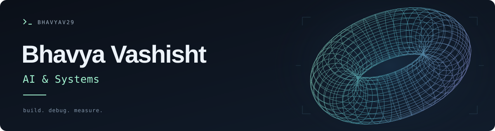

Backend services & AI tools in **Python and Go**. Previously MLE intern @ **Yum! Brands** · Thapar ’26 · Delhi NCR.

`Python` `Go` `PostgreSQL` `FastAPI` `Docker` `Kubernetes`

| AI & tooling | Backend |
| :--- | :--- |
| [**Deputy ↗**](https://github.com/BhavyaV29/deputy-agent) · Local agent & evaluations | [**Chirpy ↗**](https://github.com/BhavyaV29/chirpy) · Go + PostgreSQL API |
| [**JobOps ↗**](https://github.com/BhavyaV29/job-hunter-pipeline) · Job sourcing & tracking | [**Gator ↗**](https://github.com/BhavyaV29/Gator) · RSS aggregator |

**Open to junior backend / software / applied-AI roles.**

[Portfolio ↗](https://bhavyavportfolio.netlify.app/) · [LinkedIn ↗](https://www.linkedin.com/in/bhavya-vashisht-993079258/) · [Say hello ↗](mailto:bhavyavashisht119@gmail.com)
